---
output:
  html_document: default
  word_document: default
  pdf_document: default
---
## [FIELDimageR](https://github.com/filipematias23/FIELDimageR): an [R](https://www.r-project.org) package to analyze images from field trials in agricultural science.

> This package is a compilation of functions to analyze orthomosaic images from research fields and allows to crop the image; remove soil effect; build vegetation indices; rotate the image; build the plot shapefile; extract information for each plot; and evaluate stand count, canopy percentage, and plant height.

### Installation

> Install R/FIELDimageR from GitHub [GitHub repository](https://github.com/filipematias23/FIELDimageR). Within R, You first need to install the [R/qtl](http://rqtl.org), [htmlwidgets](http://www.htmlwidgets.org), and [devtools](https://github.com/hadley/devtools) packages.

```r
install.packages("devtools")

```
<br />

> Then install R/FIELDimageR using the `install_github` function in the [devtools](https://github.com/hadley/devtools) package.

```r
library(devtools)
install_github("filipematias23/FIELDimageR")

```
<br />

### Example use

#### 1. Packages

> * **[FIELDimageR](https://github.com/filipematias23/FIELDimageR)** 
> * **[raster](https://CRAN.R-project.org/package=raster)** 

```r
library(FIELDimageR)
library(raster)

```
<br />

#### 2. Selecting the targeted field from the original image

> The reduction of image/mosaic size around the field boundaries is necessary for faster image analysis. Function: **`fieldCrop`**. [Download EX1_RGB.tif](https://drive.google.com/open?id=1V06hLwdeKlW7xwLoyh0ez6giQD9k9moe). 

```r
EX1<-stack("EX1_RGB.tif")
plotRGB(EX1, r = 1, g = 2, b = 3)

```
<br />

<p align="center">
  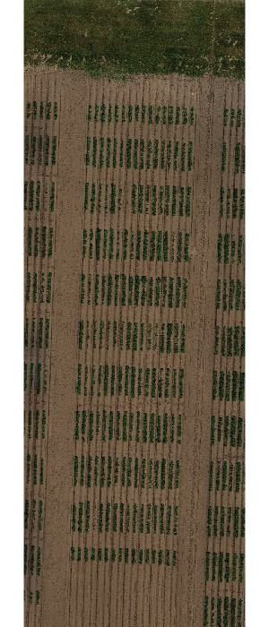
</p>

<br />

```r
EX1.Crop <- fieldCrop(mosaic = EX1, plot = T)

```
<br />

<p align="center">
  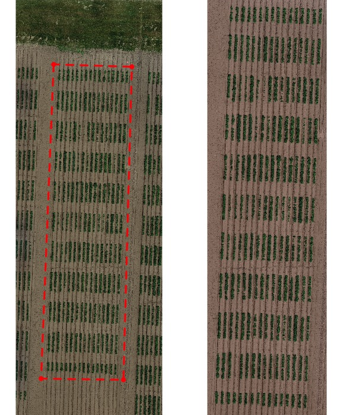
</p>

<br />

#### 3. Rotating the image

> To build the plot shape file, the image must have the trial base line at the correct position to draw the experiment field design (horizontal). Therefore, for a right straight trial, it is necessary to find the right-angle *theta* to rotate the field. Function: **`fieldRotate`** 

```r
EX1.Rotated<-fieldRotate(mosaic = EX1.Crop, clockwise = F)
EX1.Rotated<-fieldRotate(mosaic = EX1.Crop,theta = 2.3)

```
<br />

<p align="center">
  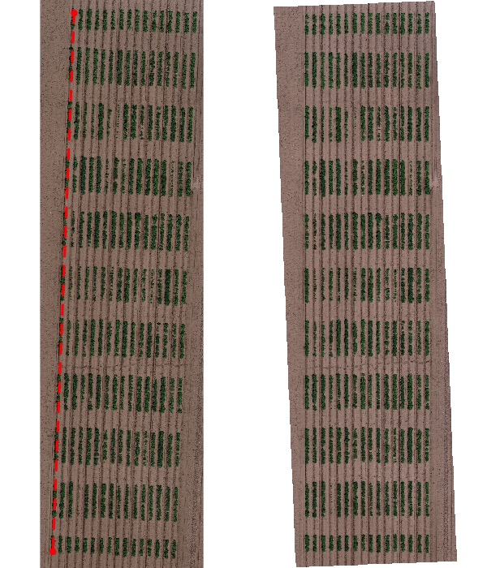
</p>

<br />

#### 4. Removing soil using vegetation indices 

> The presence of soil can introduce bias in the data extracted from the image. Therefore, removing soil from the image is one of the most important steps for image analysis in agricultural science. Function: **`fieldMask`** 

```r
EX1.RemSoil<- fieldMask(mosaic = EX1.Rotated, Blue = 1, Green = 2, Red = 3, index = "HUE")

```
<br />

<p align="center">
  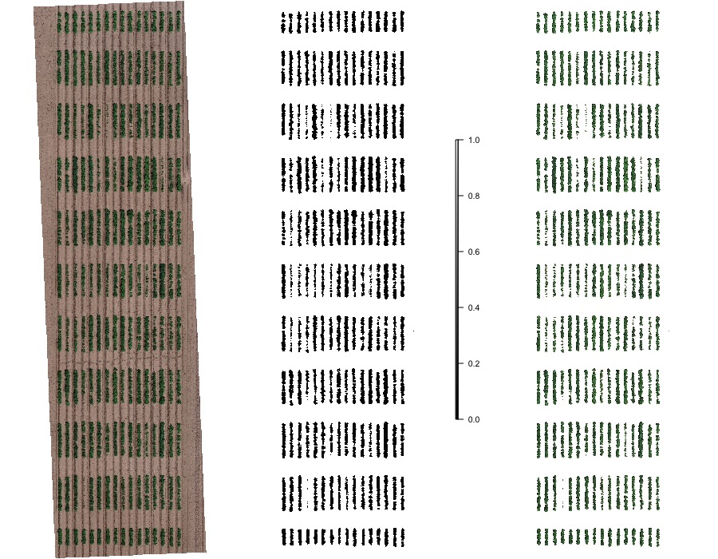
</p>

<br />

#### 5. Building the plot shape file

> The plot shape file can be drawn after rotation by selecting four points at the corners of experiment. The number of ranges and rows must be informed. And the borders can also be eliminated in this step. Function: **`fieldShape`** 

```r
EX1.Shape<-fieldShape(mosaic = EX1.RemSoil,ncols = 14, nrows = 9)

```
<br />

<p align="center">
  
</p>

<br />

> The plots are identified from left to rigth and top to bottom. The **`fieldMap`** can be used to include the plot *ID*. The column **PlotName** in the output will be the new ID. [Download DataTable.csv](https://drive.google.com/open?id=1vYTvVhvL82gm8orWnrSdZ167_b7VikRB).

```r
### Field map ID identification. 'fieldPlot' argument is the plot ID (number or name).

DataTable<-read.csv("DataTable.csv",header = T)  
fieldMap<-fieldMap(fieldPlot=DataTable$Plot, fieldRange=DataTable$Range, fieldRow=DataTable$Row, decreasing=T)
EX1.Shape<-fieldShape(mosaic = EX1.RemSoil, ncols = 14, nrows = 9, fieldMap = fieldMap)
```
<br />

<p align="center">
  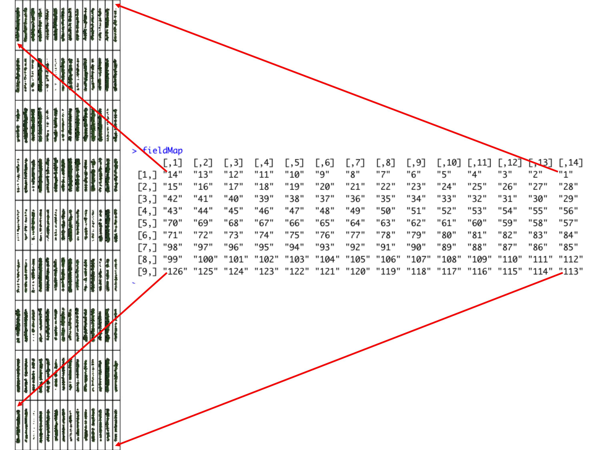
</p>

<br />


```r
### Joing all information in one "fieldShape" file:

EX1.Shape<-fieldShape(mosaic = EX1.RemSoil, ncols = 14, nrows = 9, fieldMap = fieldMap, fieldData = DataTable, ID = "Plot")

```
<br />

<p align="center">
  
</p>

<br />


#### 6. Building vegetation indices 

> A general number of indices are implemented in *FIELDimageR*. Function: **`indices`** 

<br />

<p align="center">
  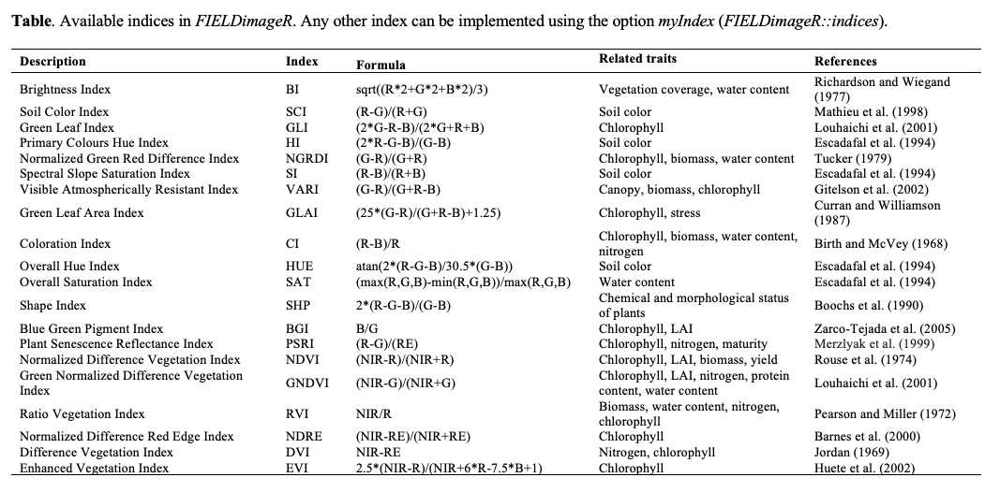
</p>
<br />

```r
# Calculating myIndex = "(Red-Blue)/Green" (not avaliable at 'FIELDimageR')

EX1.Indices<- indices(mosaic = EX1.RemSoil$newMosaic, Blue = 1, Green = 2, Red = 3, 
                          index = c("NGRDI","BGI"), myIndex = c("(Red-Blue)/Green"))
                          
```
<br />

<p align="center">
  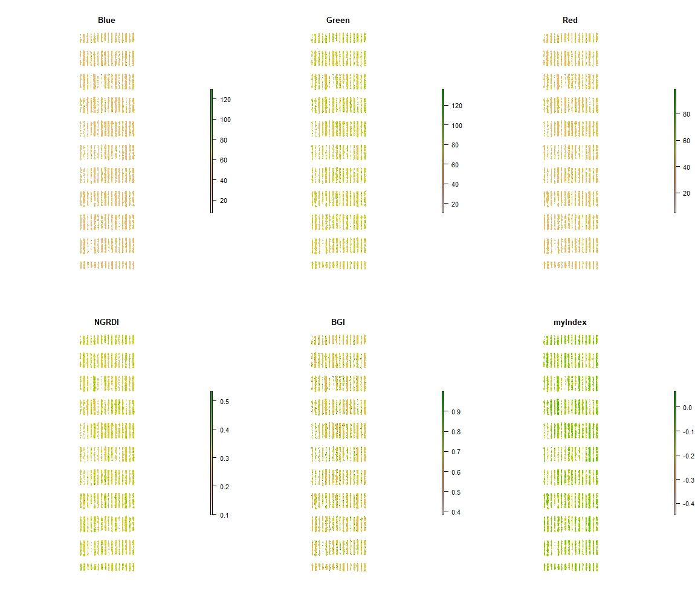
</p>

<br />

#### 7. Counting the number of plants

> *FIELDimageR* can be used to evaluate stand count during early stages. A good weed control practice should be performed to avoid misidentification inside the plot.  The *mask* output from **`fieldMask`** and the *fieldshape* output from **`fieldShape`** must be used. Function: **`standCount`**. 

```r
EX1.SC<-standCount(mosaic = EX1.RemSoil$mask, fieldShape = EX1.Shape$fieldShape, cex=0.4, col="blue")
EX1.SC$standCount

```
<br />

<p align="center">
  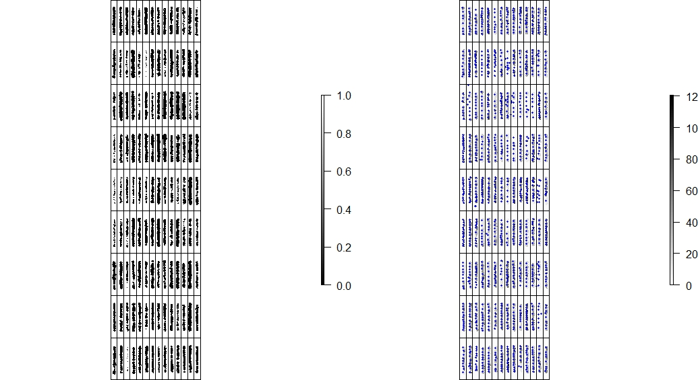
</p>

<br />

#### 8. Evaluating the canopy percentage

> *FIELDimageR* can be used to evaluate canopy percentage per plot.  The *mask* output from **`fieldMask`** and the *fieldshape* output from **`fieldShape`** must be used. Function: **`canopy`**. 

```r
EX1.Canopy<-canopy(mosaic = EX1.RemSoil$mask, fieldShape = EX1.Shape$fieldShape)
EX1.Canopy$canopyPorcent

```
<br />
<br />

#### 9. Extracting data from field images 

> The function *extract* from **[raster](https://CRAN.R-project.org/package=raster)** is adapted for agricultural field experiments through function **`getInfo`** .

```r
EX1.Info<- getInfo(mosaic = EX1.Indices,fieldShape = EX1.Shape$fieldShape)
EX1.Info$fieldShape@data

```

<br />

<p align="center">
  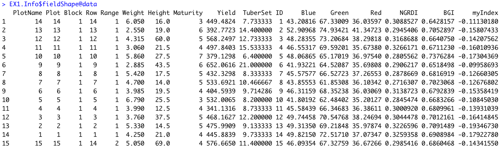
</p>

<br />

#### 10. Estimating plant height

> The plant height can be estimated using the *mask* from step 4 to remove the soil and the *fieldshape* from step 5. The estimate plant height is the difference between the Digital Surface Model (DSM) from soil base (before sprouting, [Download EX_DSM0.tif](https://drive.google.com/open?id=1R0t6P7kr55kjIB_Zwut3l4-7BybfFi_H)) and the DSM file with plants (growth cycle, [Download EX_DSM1.tif](https://drive.google.com/open?id=1qApVa5Ra7miTQJPoEeO4vuOwhoMAEC94)). The user can extract information using the basic R functions mean, max, min, and quantile as a parameter in function **`getInfo`**. 

```r
# Uploading files from soil base (EX_DSM0.tif) and vegetative growth (EX_DSM1.tif):
DSM0 <- stack("EX_DSM0.tif")
DSM1 <- stack("EX_DSM1.tif")

# Cropping the image using the previous shape from step 2:
DSM0.C <- fieldCrop(mosaic = DSM0,fieldShape = EX1.Crop)
DSM1.C <- fieldCrop(mosaic = DSM1,fieldShape = EX1.Crop)

# Canopy Height Model (CHM):
CHM <- DSM1.C-DSM0.C

# If the function above did not work resample the soil base in function of vegetative growth image before calculate the CHM:
DSM0.R <- resample(DSM0.C, DSM1.C)
CHM <- DSM1.C-DSM0.R

# Rotating the image using the same theta from step 3:
CHM.R<-fieldRotate(CHM, theta = 2.3)

# Removing the soil using mask from step 4:
CHM.S <- fieldMask(CHM.R, mask = EX1.RemSoil$mask)

# Extracting the estimate plant height average (EPH):
EPH <- getInfo(CHM.S, fieldShape = EX1.Shape$fieldShape, fun = "mean")
EPH$plotValue

```
<br />

<p align="center">
  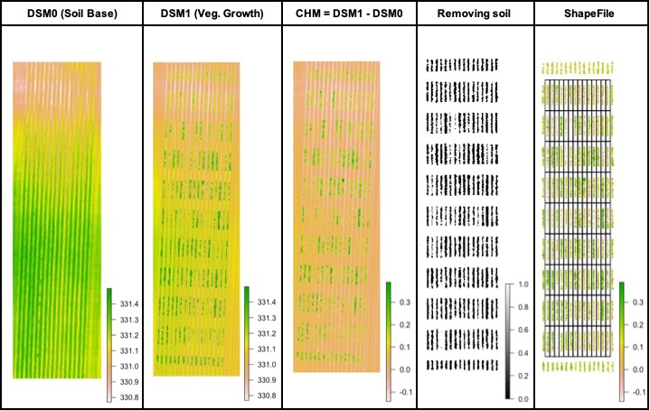
</p>

<br />

#### 11. Resolution and time

> The influence of image resolution was evaluated in different steps of FIELDimageR pipeline. For this propose, the resolution of image *EX1_RGB_HighResolution.tif* [Download](https://drive.google.com/open?id=1J0SQn3dss3aBM_4KgszS439mGLIfYUed) was reduced using the function **raster::aggregate** in order to simulate different flown altitudes Above Ground Surface (AGS). Two factors were used to reduce the original image with 0.4x0.4 cm (15m AGS), the factor 2 to simulate pixel resolution of 0.8x0.8 cm (30m AGS), and the factor 4 to simulate pixel resolution of 1.6x1.6 (60m AGS). The steps (*i*) cropping image, (*ii*) removing soil, (*iii*) rotating image, (*iv*) building vegetation index (BGI), and (*v*) getting information were evaluated using the function system.time output elapsed (R base).

```r
### Images (resolution evaluating)

RES_1<-stack("EX1_RGB_HighResolution.tif")
RES_2<-aggregate(RES_1, fact=2)
RES_4<-aggregate(RES_1, fact=4)

res(RES_1)
res(RES_2)
res(RES_4)

par(mfrow=c(1,3))
plotRGB(RES_1)
plotRGB(RES_2)
plotRGB(RES_4)

### Crooping 

system.time({RES_1_C <- fieldCrop(mosaic = RES_1,fieldShape = EX1.Crop, plot = T)})
system.time({RES_2_C <- fieldCrop(mosaic = RES_2,fieldShape = EX1.Crop, plot = T)})
system.time({RES_4_C <- fieldCrop(mosaic = RES_4,fieldShape = EX1.Crop, plot = T)})

### Rotating 
  
system.time({RES_1_R <- fieldRotate(RES_1_C,theta = 2.3, plot = T)}) 
system.time({RES_2_R <- fieldRotate(RES_2_C,theta = 2.3, plot = T)})
system.time({RES_4_R <- fieldRotate(RES_4_C,theta = 2.3, plot = T)})
  
### Removing Soil 

system.time({RES_1_S <- fieldMask(RES_1_R,Blue=1,Green=2,Red=3,index="HUE")})
system.time({RES_2_S <- fieldMask(RES_2_R,Blue=1,Green=2,Red=3,index="HUE")})
system.time({RES_4_S <- fieldMask(RES_4_R,Blue=1,Green=2,Red=3,index="HUE")})

### Indices
  
system.time({RES_1_I <- indices(RES_1_S$newMosaic,Blue=1,Green=2,Red=3,index=c("BGI"))})
system.time({RES_2_I <- indices(RES_2_S$newMosaic,Blue=1,Green=2,Red=3,index=c("BGI"))})
system.time({RES_4_I <- indices(RES_4_S$newMosaic,Blue=1,Green=2,Red=3,index=c("BGI"))})
  
### Get Information (1 Band)
  
system.time({RES_1_Info <- getInfo(RES_1_I$BGI,fieldShape = EX1.Shape$fieldShape)})
system.time({RES_2_Info <- getInfo(RES_2_I$BGI,fieldShape = EX1.Shape$fieldShape)})
system.time({RES_4_Info <- getInfo(RES_4_I$BGI,fieldShape = EX1.Shape$fieldShape)})
  
### Get Information (3 Bands)
  
system.time({RES_1_Info2 <- getInfo(RES_1_I[[c(1,2,3)]],fieldShape = EX1.Shape$fieldShape)})
system.time({RES_2_Info2 <- getInfo(RES_2_I[[c(1,2,3)]],fieldShape = EX1.Shape$fieldShape)})
system.time({RES_4_Info2 <- getInfo(RES_4_I[[c(1,2,3)]],fieldShape = EX1.Shape$fieldShape)})

### Correlation

DataBGI <- data.frame(R1=RES_1_Info$plotValue$BGI,
                    R2=RES_2_Info$plotValue$BGI,
                    R4=RES_4_Info$plotValue$BGI)
DataBlue <- data.frame(R1=RES_1_Info2$plotValue$Blue,
                       R2=RES_2_Info2$plotValue$Blue,
                       R4=RES_4_Info2$plotValue$Blue)
DataGreen <- data.frame(R1=RES_1_Info2$plotValue$Green,
                       R2=RES_2_Info2$plotValue$Green,
                       R4=RES_4_Info2$plotValue$Green)
DataRed <- data.frame(R1=RES_1_Info2$plotValue$Red,
                       R2=RES_2_Info2$plotValue$Red,
                       R4=RES_4_Info2$plotValue$Red)
cor(DataBGI)
cor(DataBlue)
cor(DataGreen)
cor(DataRed)

```
> The time to run one function using the image with pixel size of 0.4x0.4 cm can be 10 (**`getInfo`**) to 70 times (**`indices`**) slower than the image with pixel size of 1.6x1.6 cm (Table 1).  To extract BGI index (one layer) with 0.4x0.4 cm was necessary around 23 min whereas to 0.8x0.8 cm image was necessary around 7 min, and for 1.6x1.6 cm was necessary 2 minutes. To extract the RGB information (three layers) were necessary around 2.3 min to 1.6x1.6 cm image and 66 min to 0.4x0.4 cm image. However, the resolution did not affect the plots mean with correlation over then 99% between 0.4x0.4 cm and 1.6x1.6 (Table 2). In addition, high resolution images required higher computational performance, memory, and storage space. Also, during the image collection in field, low altitudes flight needs more batteries and number of pictures, and consequently long preprocessing images steps to build ortho-mosaics.

<br />

<p align="center">
  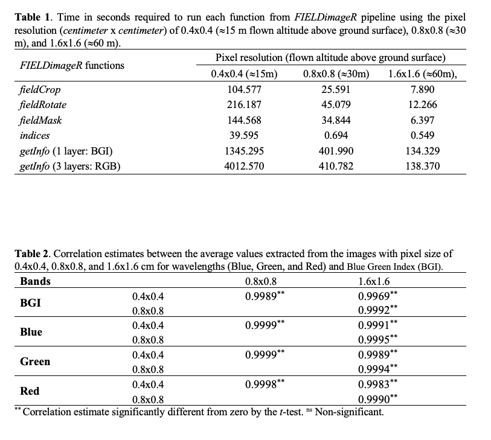
</p>

<br />

#### 12. Crop growth cycle

> The same rotation theta, mask, and plot shape file can be used to evaluate mosaics from other stages in the crop growth cycle (e.g. [**Flowering**](https://drive.google.com/open?id=18R-X1SfrpsuCg-kZRrIO2PDWwZe5LkH7) and [**Senescence**](https://drive.google.com/open?id=1JByDD1gBj9Ssr90-e3XRbu-fP-Bsm2Ff))

```r
# Uploading files from Flowering (EX2_RGB.tif) and Senescence (EX3_RGB.tif):
EX2 <- stack("EX2_RGB.tif")
EX3 <- stack("EX3_RGB.tif")

# Cropping the image using the previous shape from step 2:

EX2.Crop <- fieldCrop(mosaic = EX2,fieldShape = EX1.Crop, plot = T)
EX3.Crop <- fieldCrop(mosaic = EX3,fieldShape = EX1.Crop, plot = T)

# Rotating the image using the same theta from step 3:

EX2.Rotated<-fieldRotate(EX2.Crop,theta = 2.3, plot = T)
EX3.Rotated<-fieldRotate(EX3.Crop,theta = 2.3, plot = T)

# Removing the soil using index and mask:

EX2.RemSoil<-fieldMask(EX2.Rotated,Blue=1,Green=2,Red=3,index="HUE",cropValue=0,cropAbove=T,plot=T)
EX3.RS<-fieldMask(EX3.Rotated,Blue=1,Green=2,Red=3,index="HUE",cropValue=0,cropAbove=T,plot=T) # Removing soil at senescence stage
EX3.RemSoil<-fieldMask(EX3.RS$newMosaic,mask = EX2.RemSoil$mask ,cropValue=0,cropAbove=T,plot=T) # Removing weeds from senescence stage with flowering mask 

# Building indices

EX2.Indices <- indices(EX2.RemSoil$newMosaic,Blue=1,Green=2,Red=3,
                 index = c("NGRDI","BGI"), myIndex = c("(Red-Blue)/Green"))
EX3.Indices <- indices(EX3.RemSoil$newMosaic,Blue=1,Green=2,Red=3,
                 index = c("NGRDI","BGI"), myIndex = c("(Red-Blue)/Green"))

# Extracting data using the same fieldShape file from step 5:

EX2.Info<- getInfo(mosaic = EX2.Indices$myIndex,fieldShape = EX1.Shape$fieldShape)
EX3.Info<- getInfo(mosaic = EX3.Indices$myIndex,fieldShape = EX1.Shape$fieldShape)

```
<br />

<p align="center">
  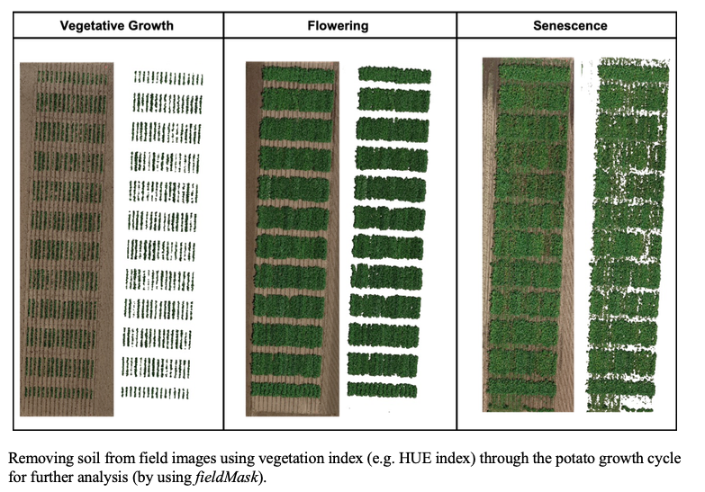
</p>

<br />

<p align="center">
  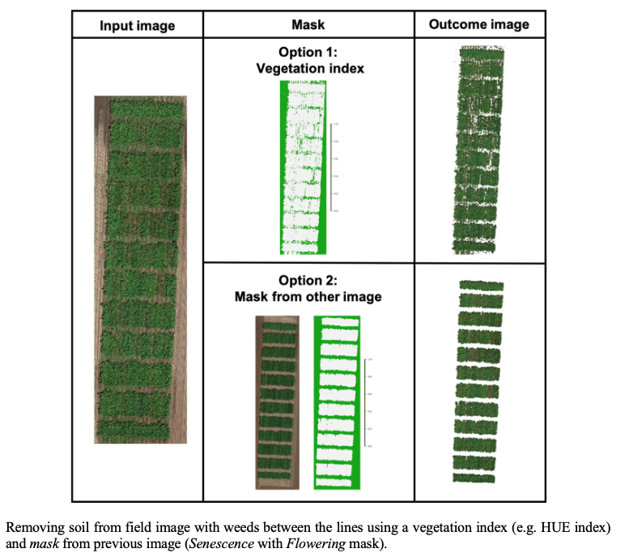
</p>

<br />

<p align="center">
  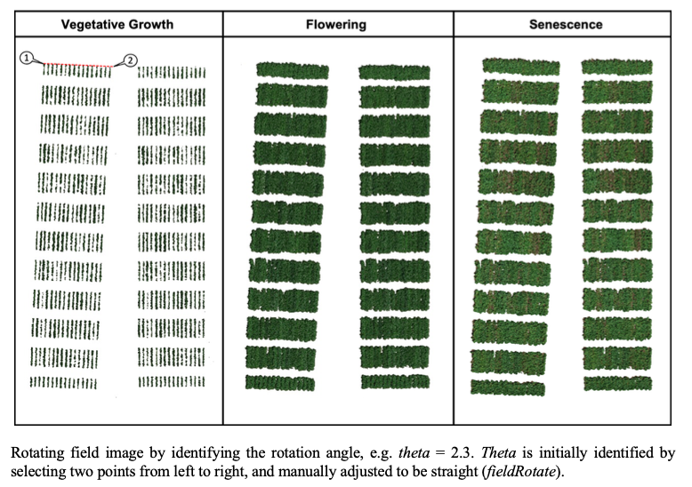
</p>

<br />

<p align="center">
  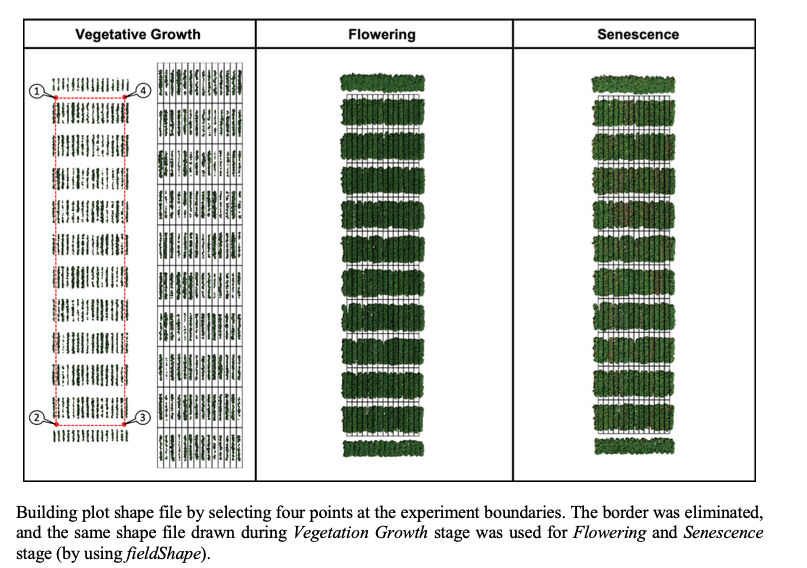
</p>

<br />

#### 13. Multispectral images

> **`FIELDimageR`** can be used to analyze multispectral images. The same rotation theta, mask, and plot shape file used to analyze RGB mosaic above can be used to analyze multispectral mosaic from the same field. [**EX1_5Band.tif**](https://drive.google.com/open?id=1ptfiJnFL6OiRygpyUBJ1hYIX1aZD2MYD) 

---

> **Attention:** HYPERSPECTRAL images were not evaluated in *`FIELDimageR`*


```r
# Uploading multispectral mosaic:
EX1.5b <- stack("EX1_5Band.tif")

# Cropping the image using the previous shape from step 2:

EX1.5b.Crop <- fieldCrop(mosaic = EX1.5b,fieldShape = EX1.Crop, plot = T)

# Rotating the image using the same theta from step 3:

EX1.5b.Rotated<-fieldRotate(EX1.5b.Crop,theta = 2.3, plot = T)

# Removing the soil using index and mask:

EX1.5b.RemSoil<-fieldMask(EX1.5b.Rotated,Blue=1,Green=2,Red=3,index="HUE",cropValue=0,cropAbove=T,plot=T)

# Building indices (NDVI and NDRE)

EX1.5b.Indices <- indices(EX1.5b.RemSoil$newMosaic,Blue=1,Green=2,Red=3,RedEdge=4,NIR=5,
                 index = c("NDVI","NDRE"))

# Extracting data using the same fieldShape file from step 5:

EX1.5b.Info<- getInfo(mosaic = EX1.5b.Indices$NDVI,fieldShape = EX1.Shape$fieldShape)

```
<br />

#### 14. Making plots

> Graphic visualization of trait values for each plot using the **fieldShape file** and any **Mosaic**. Function: **`fieldPlot`**.

```r
### Interpolating colors: c("white","black")

fieldPlot(fieldShape=New.Shape,fieldAttribute="Yield", mosaic=EX1.Indices, color=c("white","black"), alpha = 0.5)

### Interpolating colors: c("red","blue")

fieldPlot(fieldShape=New.Shape,fieldAttribute="myIndex", mosaic=EX1.Indices, color=c("red","blue"), alpha = 0.5)

```
<br />

<p align="center">
  
</p>

<br />

### Licenses

> The R/FIELDimageR package as a whole is distributed under [GPL-2 (GNU General Public License version 2)](https://www.gnu.org/licenses/gpl-2.0.en.html).

<br />

### Author

> * Filipe Inacio Matias

<br />

### Acknowledgments

> * [University of Wisconsin](https://horticulture.wisc.edu)
> * [UW Potato Breeding and Genetics Laboratory](https://potatobreeding.cals.wisc.edu)
> * [Sentera](https://sentera.com) 

<br />
<br />

